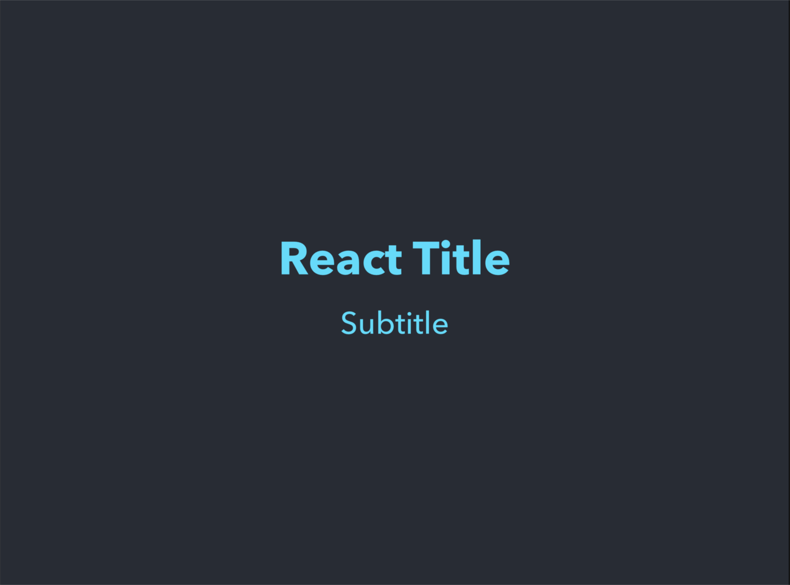
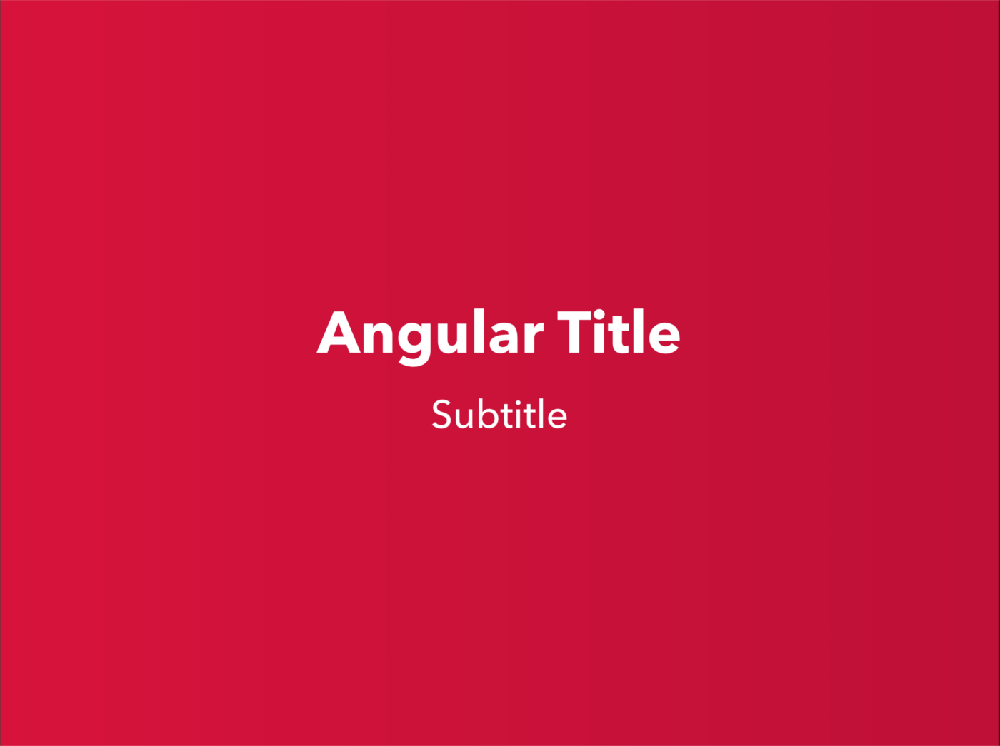
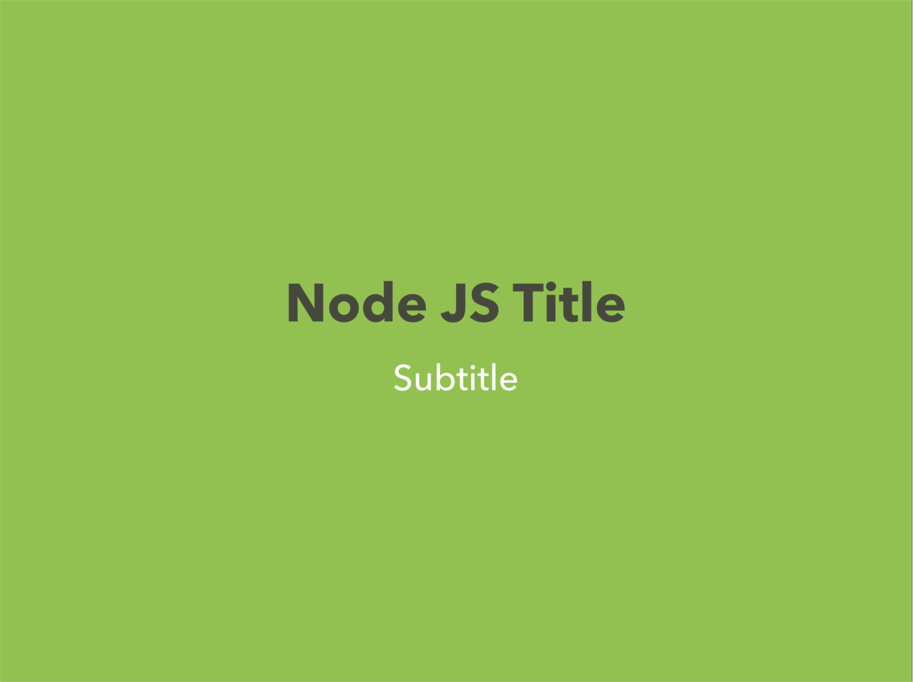

# js-keynote-theme
keynote theme for JavaScript, React, Angular and Node.js.

# How to use
1. Download
```
git clone git@github.com:shisama/js-keynote-theme.git
```
or
```
git clone https://github.com/shisama/js-keynote-theme.git
```
or [Download Zip](https://github.com/shisama/js-keynote-theme/archive/master.zip)

2. Open JavaScript.kth

# Color Codes
|theme|background|text|
|:---:|:--------:|:---:|
|JavaScript|<div style="background-color:#F2DE57">#F2DE57</div>|#2E2E2E|
|React|#282C34|#61DAFB|
|Angular|#DA0B37<br>#C10934|#FFFFFF|
|Node.js|#91C349|#46483D|
|Non Theme|#FFF5E2|#3E4157|

# Sample





